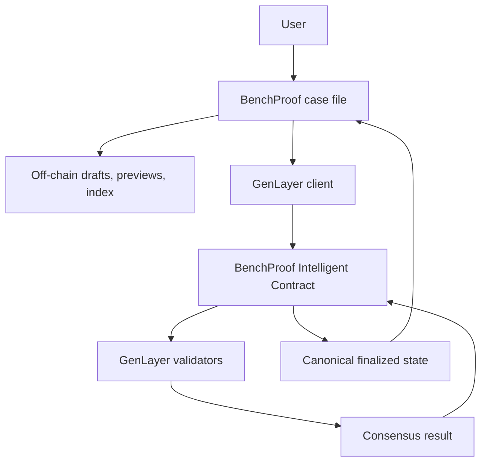

# BenchProof

**Prove the benchmark, not just the score.**

BenchProof is a verification and dispute layer for published AI benchmark claims, built on [GenLayer](https://genlayer.com) Intelligent Contracts. It is not a leaderboard. A leaderboard compares two numbers; BenchProof asks whether the sentence those numbers are wrapped in is fairly supported by the evidence.

```text
CLAIM → EVIDENCE → CHALLENGE → GENLAYER EVALUATION → VERDICT
```

## Current live proof

| | |
| --- | --- |
| Network | Studionet · chain ID 61999 |
| Contract | [`0x2368a42582710f61AF4f29A432990328db32a2ec`](https://explorer-studio.genlayer.com/address/0x2368a42582710f61AF4f29A432990328db32a2ec) |
| Version | `BenchProof-v1.0.1` |
| Deploy tx | [`0xd2b875…669fa`](https://explorer-studio.genlayer.com/tx/0xd2b875600a60ef8bff48488441a4e9183940adde5cb6de46e5b5df02637669fa) · status 7 FINALIZED · MAJORITY_AGREE |
| Evaluation tx | [`0x3ce022…be6a`](https://explorer-studio.genlayer.com/tx/0x3ce022d3e3874f85854c74e307a6acf231892b9563c459916acd4f699ca7be6a) · FINALIZED · MAJORITY_AGREE · FINISHED_WITH_RETURN |
| Claim 1 verdict | `INSUFFICIENT_EVIDENCE` |
| Why | Benchmark and conditions are disclosed, but no raw per-task results are attached. |
| Public reads | **38/38 PASS**: all 21 public views plus invalid-ID safety checks |
| Studio | [studio.genlayer.com/contracts](https://studio.genlayer.com/contracts) |

Production: [https://benchproof.bydx.fun](https://benchproof.bydx.fun) · source: [github.com/0xbardia/benchproof](https://github.com/0xbardia/benchproof)

Open the case file: [https://benchproof.bydx.fun/claims/onchain-1](https://benchproof.bydx.fun/claims/onchain-1).

The corrected deployment is new evidence. The previous v1.0.0 deployment remains archived in `docs/historical-*` and was not mutated.

## Why BenchProof

Benchmark claims fail in ways a `scoreA > scoreB` check cannot see:

- outdated baselines presented as current
- cherry-picked tasks
- unequal retries, prompts, or tools
- hidden failed runs
- headlines the numbers do not carry

## How it works

1. File the exact claim: models, versions, metric, methodology, and conditions.
2. Attach evidence as hashes and references. Large artifacts stay off-chain.
3. Anyone may challenge on a structured category.
4. Request evaluation. GenLayer validators reason over the structured, untrusted record.
5. Consensus writes one of `SUPPORTED`, `PARTIALLY_SUPPORTED`, `INSUFFICIENT_EVIDENCE`, `MISLEADING`, or `INVALID`.

## Why GenLayer

A deterministic contract can verify `87.2 > 84.1`. It cannot reasonably decide whether conditions were comparable, whether a baseline is outdated, or whether the evidence is sufficient for the published sentence.

That judgment is the product. Validators inspect the same payload under `gl.eq_principle.prompt_non_comparative` and must agree on a verdict enum. Untrusted content is serialized as data, and strict parsing fails closed to `INVALID`; malformed output can never become `SUPPORTED`.

Remove the Intelligent Contract and BenchProof is just a form.

## Architecture



- **Off-chain:** drafts, pending operations, preview evaluations, listings, metadata, and transaction tracking.
- **On-chain:** published claim fields, evidence references/hashes, challenges, evaluation, and finalized verdict.
- The index is a cache. It never overrides canonical finalized chain state.

## Intelligent Contract

Source: [`contracts/benchproof.py`](contracts/benchproof.py) · version `BenchProof-v1.0.1`

States: `DRAFT` → `OPEN` → `CHALLENGED` → `EVALUATING` → `FINALIZED`

Writes: `create_claim`, `add_evidence`, `publish_claim`, `challenge_claim`, `request_evaluation`.

The contract evaluates submitted metadata, references, and hashes. It does not fetch arbitrary evidence URLs. Required evaluator fields, types, allowed verdicts, array bounds, and `SUPPORTED` evidence requirements are validated strictly.

## Frontend

React 19 + TanStack Start/Router, Tailwind. Routes live in `src/routes/`. The UI is a case file: claim, evidence, challenge, verdict stamp, and provenance — not a leaderboard.

## Backend

Nitro/Vite production server (`srvx` in PM2). Off-chain index in PostgreSQL or file-backed PGlite (`PGLITE_DATA_DIR`). Server modules talk to GenLayer Studio RPC, persist drafts and pending operations, and never put signer keys in the client bundle.

## Application

| Route | Purpose |
| --- | --- |
| `/` | Product landing + verified Studionet proof |
| `/claims` | Bounded ledger, with on-chain cases first |
| `/claims/new` | Structured claim draft form |
| `/claims/$id` | Case file: claim, evidence, challenge, verdict, provenance |
| `/claims/$id/challenge` | Canonical challenge form for an open chain case |
| `/methodology` | Evaluation rubric |
| `/docs` | Architecture and deployment identity |
| `/roadmap` | Product scope |

## Persistence and writes

Production uses PostgreSQL when configured, otherwise an explicit file-backed PGlite directory is required. It does not silently fall back to in-memory storage in production. Public mutations use durable idempotency records, bounded inputs, same-origin checks, and server-side per-process rate limits. V1 uses operator-controlled server signers rather than pretending a display name is an authenticated wallet identity; wallet-native writes are post-V1.

## Development setup

Requires Node.js 22+ (`--experimental-strip-types` is used by `npm test`).

```bash
git clone https://github.com/0xbardia/benchproof.git
cd benchproof
cp .env.example .env
npm install
npm run dev
```

The preview/dev server binds `0.0.0.0:8080`. Production in this deployment is Nginx → `127.0.0.1:4300` (PM2 process `benchproof`).

## Environment variables

See `.env.example`. Public GenLayer identity (`VITE_GENLAYER_*`) is safe to commit as examples. Never commit `GENLAYER_*_PRIVATE_KEY`, `DATABASE_URL` passwords, `XAI_API_KEY`, or auth secrets.

## Testing

```bash
npm test
npm run typecheck
npm run lint
npm run build
```

Current source gates: **198 script tests + 82 TypeScript tests pass (280 total)**, typecheck passes, lint has zero errors, and the production build passes. Coverage includes strict evaluator parsing, adversarial output, prompt injection, state transitions, SSRF guards, hash parity, and contract-read verification scripts.

## Security posture

This is a security-reviewed V1 implementation, not a formal independent audit. Controls include strict structured evaluation parsing, fail-safe `INVALID`, bounded inputs and reads, legal state transitions, finalized-state protection, structured untrusted-data boundaries, no arbitrary URL fetch in the contract, SSRF guards on the index, same-origin mutation checks, idempotency, rate limits, safe public errors, and no signer secrets in the client bundle.

## Deployment

Web: production Vite/Nitro build behind Nginx and the single `benchproof` PM2 process.

Contract: `node scripts/deploy-genlayer.mjs` targeting [GenLayer Studio](https://studio.genlayer.com/contracts). The current deployment record is `docs/deployment-result.json`; the previous deployment is preserved in `docs/historical-deployment-v1.0.0.json`.

## Known limitations

- V1 judges submitted metadata, references, and hashes; it does not retrieve arbitrary evidence URLs.
- The production app uses operator-controlled service and challenger signers, not in-browser wallet-native ownership.
- Rate limiting is in-process and therefore sized for the current single PM2 instance; a multi-instance deployment needs a shared limiter/worker.
- Chain synchronization is bounded to 100 claims and runs in the background on a 60-second cadence.
- There are no token bonds, slashing, appeals, or external benchmark adapters in V1.

## Historical deployment

The previous contract `0x0E6A637e78241D5005245281Bc92d7C3aA09e197` and its deployment/evaluation transactions are retained as historical evidence only. The application points to the v1.0.1 deployment above.

## Roadmap

V1.1 wallet-native writes · V1.2 signed evidence manifests · V1.3 allow-listed evidence adapters · V1.4 claim bonds and challenger incentives · V1.5 benchmark integrations.

No dates are promised. These are post-V1 extensions, not prerequisites for the adjudication primitive.

## License

MIT. See [LICENSE](LICENSE).
