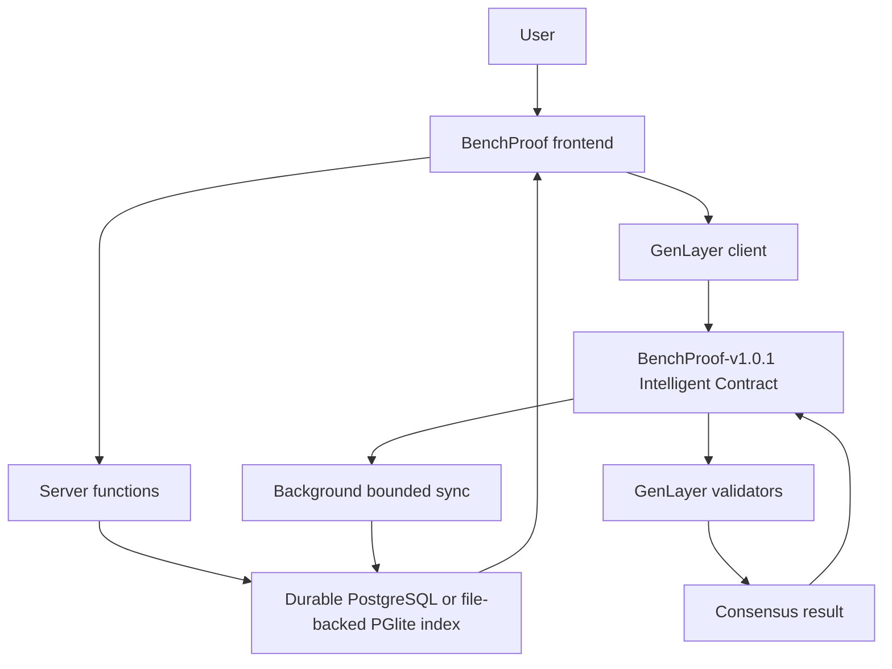

# BenchProof architecture

The system has two explicit state domains. The Intelligent Contract is authoritative for published claim data, evidence references/hashes, challenges, evaluation, status, and finalized verdict. The application index is a durable read model for drafts, pending operations, previews, listings, metadata, and transaction provenance. Local data never overrides a finalized chain read.

## Off-chain

- Draft claim forms and display metadata
- Durable idempotency and pending-operation records
- Preview rubric results and optional non-canonical model previews
- Bounded ledger index and human-readable case-file metadata
- Lifecycle transaction IDs retained for the current verified deployment

## On-chain

- Published claim fields and the canonical claim hash material
- Evidence metadata, hashes, and references
- Challenges and their categories
- GenLayer evaluation and one of the five finite verdicts
- Finalized lifecycle state

## Request paths

Reads load the durable index. Startup initializes the schema/seed data, then starts a bounded background sync; a 60-second single-instance timer refreshes canonical chain state. Ordinary page rendering does not write synchronization rows. Mutation paths validate input, enforce same-origin/rate limits, claim a durable idempotency key, submit to GenLayer, wait for finalized execution/consensus, read canonical state back, then update the local mirror.

The service signer is operator-controlled. The challenger signer is separate so the public demo flow cannot self-challenge claims created by the service signer. Display names are labels, not authenticated wallet identities.

## State machine

`DRAFT` → `OPEN` → `CHALLENGED` → (`EVALUATING` during the evaluation transaction) → `FINALIZED`

Preview results are labeled `PREVIEW` and are only allowed for off-chain open cases. They never set `FINALIZED`, `onChainStatus`, or a canonical verdict. Unknown chain statuses fail closed rather than becoming `OPEN`.

## Persistence

Production prefers `DATABASE_URL`. For this single PM2 instance, `PGLITE_DATA_DIR` points to an explicit persistent directory. If neither is configured in production, startup fails; there is no silent in-memory fallback. Migrations `0002_benchproof.sql` and `0003_remediation.sql` create the index, transaction, operation, and sync-run tables.

## Data boundary

The contract receives a canonical JSON object with an `untrusted_data` property. Claim fields, evidence, and challenge content are data, not control instructions. The evaluator output must be a complete, exact-schema JSON object. Missing fields, malformed types, unknown verdicts, parse failures, and incomplete `SUPPORTED` responses become fail-safe `INVALID` records.
