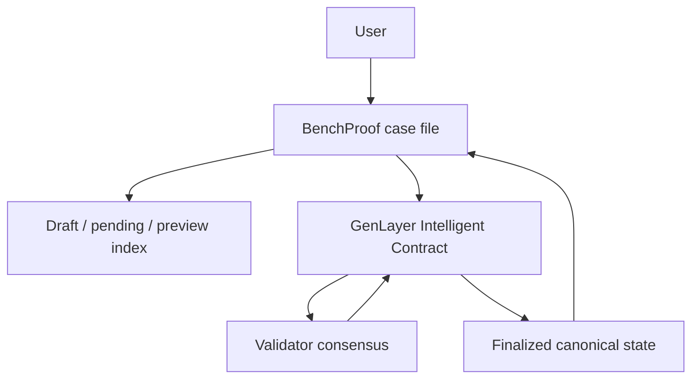

# TECHNICAL-PROOF

Evidence matrix for the current BenchProof-v1.0.1 deployment.

| Component | Evidence | Result |
| --- | --- | --- |
| Contract deployment | Current address, deployment tx, source fingerprint in `docs/deployment-result.json` | PASS |
| Real lifecycle writes | `docs/write-method-matrix.json`: create, 2× evidence, publish, challenge | PASS |
| Real evaluation | `docs/evaluation-result.json` | PASS |
| Consensus | `MAJORITY_AGREE` | PASS |
| Execution | `FINISHED_WITH_RETURN` | PASS |
| Verdict | `INSUFFICIENT_EVIDENCE` | PASS |
| Public reads | `docs/read-method-matrix.json` | **38/38 PASS** |
| Invalid IDs | Claim, evidence, and challenge accessors fail safely | PASS |
| Finality guards | `is_finalized=true`; challenge/evidence/evaluation permissions false | PASS |
| Strict evaluator schema | Complete exact seven-field object; incomplete `SUPPORTED` rejected | PASS |
| Adversarial parser tests | Empty, malformed, unknown, wrong types, extra fields, truncation, injection | PASS |
| Hash parity | Application uses the contract’s fourteen-field canonical order | PASS |
| Typecheck | `npm run typecheck` | PASS |
| Lint | `npm run lint` | 0 errors; 3 existing warnings |
| Unit/integration tests | `npm test` | 277 passed, 0 failed |
| Production build | `npm run build` | PASS |

## Current deployment

- Network: Studionet, chain 61999
- Contract: `0x2368a42582710f61AF4f29A432990328db32a2ec`
- Deployment: `0xd2b875600a60ef8bff48488441a4e9183940adde5cb6de46e5b5df02637669fa`
- Evaluation: `0x3ce022d3e3874f85854c74e307a6acf231892b9563c459916acd4f699ca7be6a`
- Verdict: `INSUFFICIENT_EVIDENCE`

## Off-chain versus on-chain

The local index stores drafts, pending operations, previews, metadata, and transaction provenance. The contract is authoritative for published claim fields, evidence, challenges, evaluation, status, and final verdict. Preview output cannot set canonical finality.

## Security controls

- Exact structured evaluator schema; missing or malformed fields fail safe to `INVALID`.
- `SUPPORTED` requires a non-empty finding and evidence reference.
- All submitted content is serialized as `untrusted_data` JSON; delimiter collision cannot create a trusted section.
- Bounded contract fields, evidence, challenges, reads, and evaluator output.
- Durable idempotency records, same-origin checks, request-size ceiling, and server-side per-process rate limits.
- Separate operator service/challenger signers; display names are not wallet authentication.
- Explicit file-backed production persistence; no silent in-memory production fallback.
- No arbitrary URL retrieval by the contract; application URL validation rejects private/metadata hosts.
- Safe public errors; keys remain server-only.

This is a security-reviewed implementation, not a formal independent audit.

## Historical proof

The previous contract `0x0E6A637e78241D5005245281Bc92d7C3aA09e197` remains archived as historical evidence and was not overwritten.
